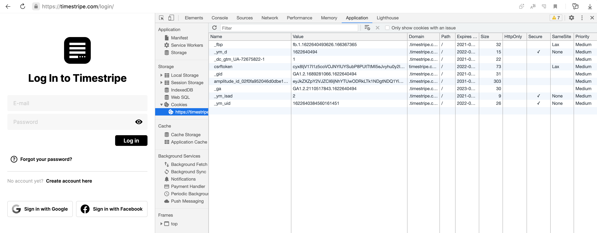
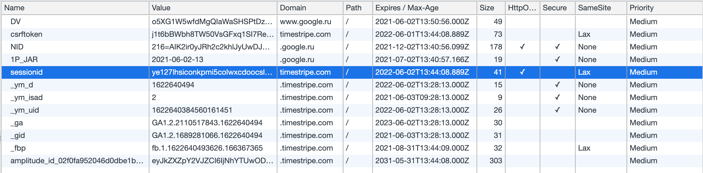
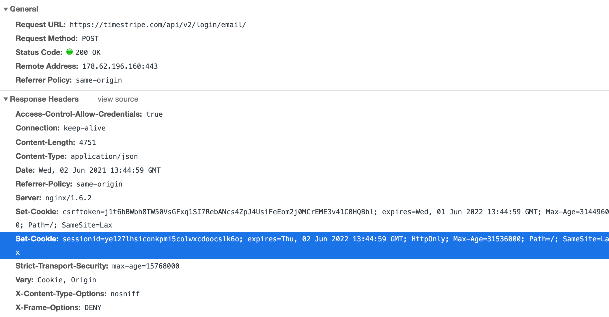
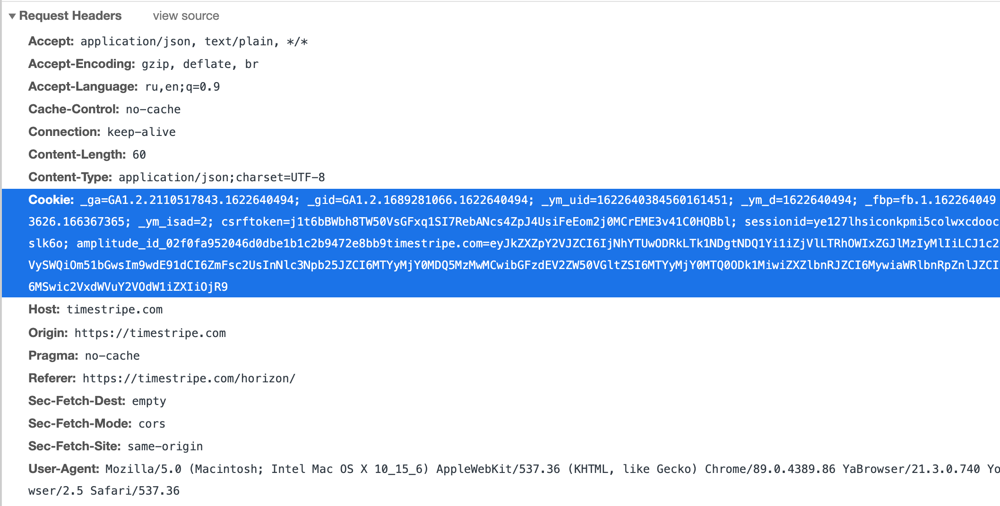

<h1>аутентификацию на фронтенде</h1>

Мои mentee [на Solvery](https://solvery.io/ru/mentor/mikhail_malyshev) часто просят рассказать про аутентификацию.
Решил написать статью по основам, чтобы не повторяться.
Обычно этих основ достаточно для того, чтобы ориентироваться в теме и
отвечать на вопросы из собесов.

Чтобы понять статью, нужно знать [что такое HTTP-запросы и их заголовки](https://doka.guide/tools/http-protocol/).

## Не авторизация

[Аутентификация это не авторизация](https://www.kaspersky.ru/blog/identification-authentication-authorization-difference/29123/), FYI.

### Кратко

Аутентификация — "залогинивание".

Авторизация — проверка прав залогиненного пользователя.

## Куки

Куки — хранилище типа ключ-значение внутри бразуера. Куки часто используются для хранении данных аутентифицированной сессии,
поэтому разработчик, работающий с аутентификацией, обязательно должен понимать принцип их работы.

Покажу как они работают на примере логина в [timestripe.com](https://timestripe.com).

Я открыл страницу входа в инкогнито и перешёл раздел Cookies во вкладке Applicaton в инструментах разработчика.



Сейчас в таблице уже есть несколько записей, которые были добавлены при загрузке страницы.
На них можно не обращать внимания, большинство из них это идентификаторы для трекеров вроде Яндекс.Метрики или Гугл Аналитикс.

После того, как я ввёл логин и пароль, в таблице появилась новая запись с ключом `sessionid`:



Эта строка — _идентификатор аутентифицированной сессии_, наличие которого даёт мне доступ к аккаунту, под которым я вошёл.
Если я скопирую эту строку и введу её в такой же таблице на другом компьютере, то после обновления страницы я окажусь залогиненным под этим аккаунтом.

Как она попала в эту таблицу? Чтобы это понять, открываю вкладку Network и нахожу запрос на `https://timestripe.com/api/v2/login/email/`:



В разделе Response Headers есть заголовок Set-Cookie, в котором указано имя куки, её значение и некоторые другие параметры.
Эту куку в мой бразуер установил сервер, добавив заголовок Set-Cookie в ответ на мой запрос логина.



Теперь в последующих запросах в заголовках запроса передаётся значение этой куки. Так сервер понимает,
что за пользователь делает запрос и возвращает данные, если эта сессия есть в его базе данных.
Примерно так работает аутентификация на основе кук.

## Access token и его хранение

_Access token_, или просто _токен_ — секретная строка, которую фронтенд-приложение передаёт вместе с каждым запросом на бэкенд,
чтобы получить доступ. Значение куки sessionid это тоже своего рода токен.

Некоторые виды токенов, например JWT, могут иметь в себе закодированную информацию, а ещё их часто подписывают криптографически.
Это позволяет серверу не хранить их в своей базе данных. Подробнее о JWT в следующем разделе.

### HttpOnly куки

Токен часто хранят в HttpOnly куках, принято считать его самым безопасным.
HttpOnly куки это такие куки, которые нельзя читать и изменять на фронтенде.
Иначе говоря, если в браузерной консоли вывести `document.cookie`,
то там будут не все куки, а только те, у которых нет флага HttpOnly.

> Про безопасность: не надейтесь только на HttpOnly. Если злоумышленник смог выполнить произвольный код на вашей странице, он сможет получить любую информацию без чтения кук просто слушая события с клавиатуры. Поэтому [настройте CSP](https://developer.mozilla.org/ru/docs/Web/HTTP/CSP).

С HttpOnly куками может работать только сервер — через заголовки: Cookie для чтения и Set-Cookie для установки значения.

### Local Storage

Ещё один способ хранения токена это window.localStorage. Как я писал выше,
HttpOnly куки не делают приложение намного более защищённым, поэтому использование Local Storage — вполне валидный вариант.

## JWT

JSON Web Token — токен, который состоит из трёх строк — заголовок (header), данные (payload) и криптографическая подпись (signature).
Первые две — закодированный JSON, а третья вычисляется на основе первых двух.
Третью строку может сгенерировать только хозяин приватного ключа, у нас это бэкенд приложения. Поэтому подделать токен не имея приватного ключа невозможно.

Подробнее можно [прочитать на Википедии](https://en.wikipedia.org/wiki/JSON_Web_Token).

Отладчик JWT есть на сайте [jwt.io](https://jwt.io/), в нём можно вставить JWT и посмотреть содержимое первых двух частей токена.

## OAuth

OAuth — открытый протокол для аутентификации через сторонний сервис, например через Фейсбук.

Базово он работает так: пользователь нажимет на ссылку «Войти через Фейсбук» и попадает на страницу с адресом вида:

```
https://www.facebook.com/v8.0/dialog/oauth?client_id=444260785757555&redirect_uri=https%3A%2F%2Fexample.com%2Ffacebook_oauth
```

В этом адресе обычно есть client id — идентификатор сайта или приложения, куда пользователь пытается войти
и redirect uri — адрес, который откроет фейсбук после того, как пользователь подтвердит вход.

Затем пользователь нажимает «Разрешить доступ» и Фейсбук открывает страницу с адресом из redirect uri и добавляет туда query-параметр `access_token`:

```
https://example.com/facebook_oauth?access_token=18hs9sj1ka09wbw0cna9cne0vmw0cm
```

Обрабатывая запрос, сервер example.com берёт этот `access_token`. После этого, бэкенд example.com сможет общаться с бэкендом Фейсбука, например получить имя и email пользователя.

Если с этим `access_token` получилось забрать данные из Фейсбука, то example.com залогинивает пользователя: например, прислав в ответе уже знакомый нам заголовок Set-Cookie.

## Заключение

Я постарался рассказать кратко и просто, поэтому где-то мог ошибиться в деталях или через чур упростить.
Если что-то осталось непонятно или хочется поделиться фидбэком, прошу писать в телегу.

Всем лёгкой аутентификации <span role="image" alt="Эмодзи два пальца">✌️</span>
