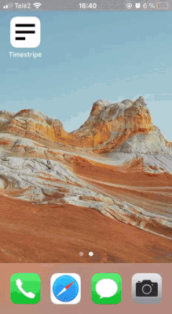
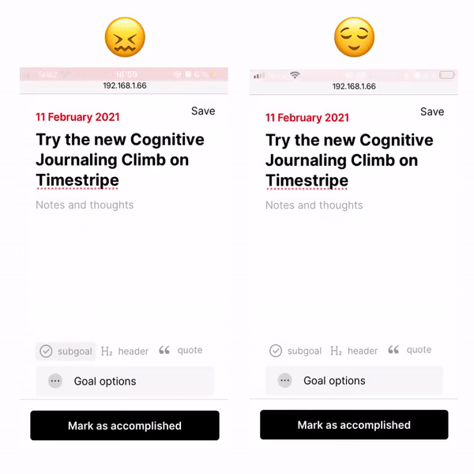
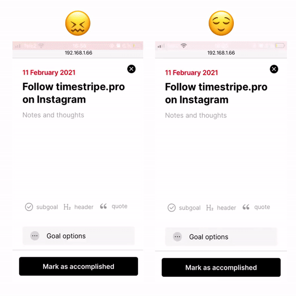
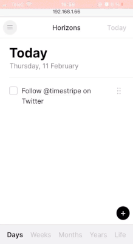
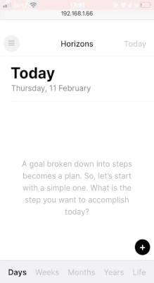

<h1>{props.pageContext.frontmatter.title}</h1>
При разработке PWA или гибридного приложения я хочу, чтобы оно ощущалось нативно. Хотя в вебе сложно
достичь нативной плавности, есть несколько UX-трюков, которые обманут даже опытного пользователя.

В этой статье расскажу про известные мне приёмы, их я использовал в мобильной версии [Timestripe](https://timestripe.com/).

## Добавляем манифест



Web app manifest — часть PWA. PWA это веб-приложение, которые можно установить на устройство и запускать без интерфейса браузера в собственном окне.
PWA это классно. Мгновенная установка, доступ к нативным API, offline-first и так далее.

Превратить веб-приложение в топовое offline-first PWA непросто. Но начать — супер изи: создаём в папке со статикой manifest.json и теперь
приложение можно добавлять на рабочий стол и запускать отдельно от браузера! После этого при желании докручиваются остальные PWA-приколы, про это можно [почитать здесь](https://web.dev/progressive-web-apps/).

[Подробнее о манифестах веб-приложений на MDN](https://developer.mozilla.org/en-US/docs/Web/Manifest).

[Здесь](https://timestripe.com/static/v2/manifest.webmanifest.json) можно посмотреть на крохотный манифест Таймстрайпа.

## Ставим прозрачный -webkit-tap-highlight-color



Свойство -webkit-tap-highlight-color определяет цвет полупрозрачных прямоугольников, которые появляются над интерактивными элементами UI во время нажатия.

Эта штука нужна на всякий случай, чтобы неотзывчивые интерфейсы горе-верстальщиков давали хоть какой-то фидбэк. Я делаю интерфейсы с быстрой обратной связью,
поэтому у меня эти хайлайты прозрачные:

```css
body {
    -webkit-tap-highlight-color: transparent;
}
```

## Убираем стили ховеров



На тач-устройствах нет такого понятия, как ховер, потому что там нет курсора.
Но мобильные браузеры показывают стили ховеров, когда пользователь нажимает или проводит пальцем по элементу.
Проблема в том, что состояние ховера зависает до следующего нажатия или свайпа — лично меня это бесит, а любой опытный пользователь сразу почувствует запах веба.

Самый простой способ избежать этого — убирать стили ховеров в рантайме. И для такого уже написали библиотеку: https://github.com/kof/remove-hover

## Выключаем pinch-to-zoom



Потому что нативные приложения не зумятся!

Ставим `user-scalable: 0` в `meta viewport`. Пример из тэга `head` Таймстрайпа:

```html
<meta
    name="viewport"
    content="width=device-width, initial-scale=1.0, maximum-scale=1.0, user-scalable=0"
/>
```

## Убираем оверскролл в Сафари



Под оверскроллом я подразумеваю визуальный эффект эластичности прокрутки.
Сам по себе он не является чем-то плохим, но в моём случае это ещё одна улика, свидетельствующая о вебвью.

На эту тему есть [хорошая статья](https://www.bram.us/2016/05/02/prevent-overscroll-bounce-in-ios-mobilesafari-pure-css/).

## Бонус: react-easy-swipe


Для Реакт-приложений есть супер-инструмент — [библиотека react-easy-swipe](https://github.com/leandrowd/react-easy-swipe). С помощью неё можно добавить в любой компонент поддержку свайпов.

В Таймстрайпе она используется для сайдбара, экранов с горизонтальными свайпами и каруселей.

## Ещё по теме

- [Make your PWA feel more like an app, Thomas Stainer](https://web.dev/app-like-pwas/)
- [Building Native-like Experiences on the Web with PWAs, Miloš Žikić](https://spicefactory.co/blog/2019/10/18/native-like-pwas/)
- [How you can develop Progressive Web Apps that feel like native mobile apps, Samuele Dassatti](https://medium.com/swlh/how-you-can-develop-progressive-web-apps-that-feel-native-5110fbbcbf4b)

Надеюсь статья получилась полезной!

Подписывайтесь на [Таймстрайп в Инстаграме](https://instagram.com/timestripe.pro) и на [меня](https://instagram.com/malyshev.pro) тоже.